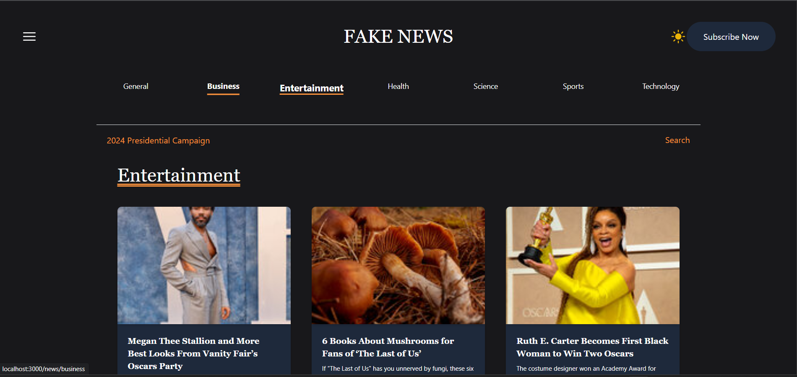
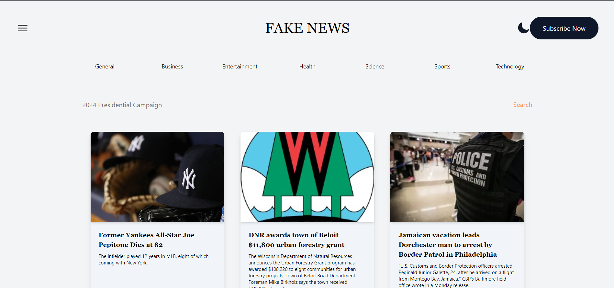
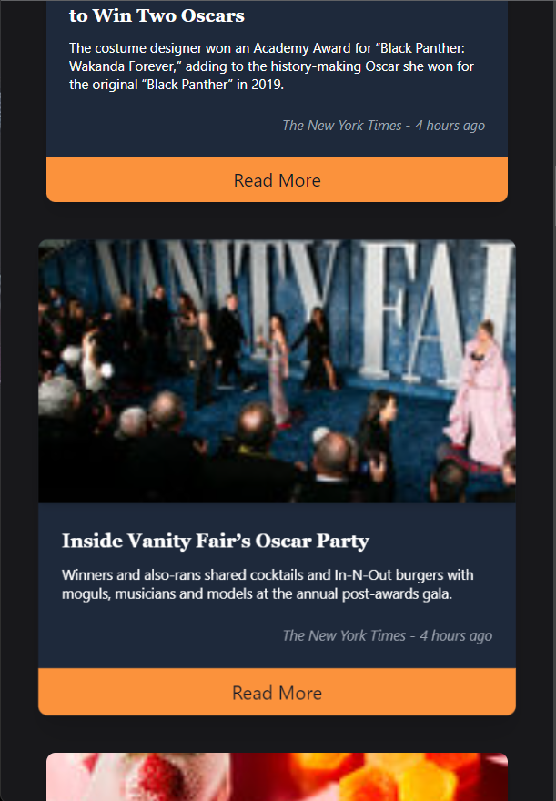
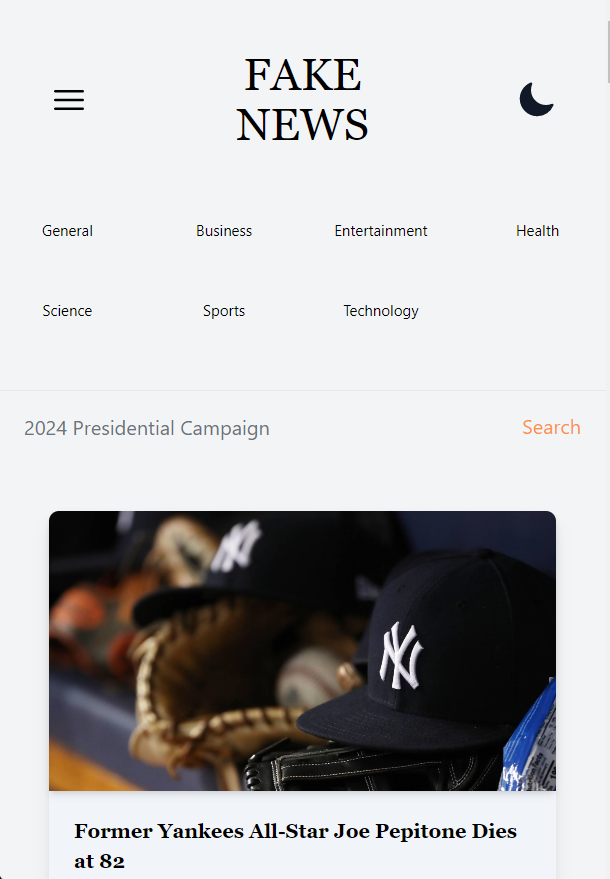

# FakeNews Live News-Media App

Live News-Media mobile-responsive website with data from the MediaStack API and dark mode enabled

- Dynamic page rendering by category and search 
- Single-page website made mobile responsive (and dark mode) using React.js, Next.js 13, TypeScript and HTML5/Tailwind CSS. 
- Live news content is populated from the MediaStack API

### User Story
```
AS a consumer
I WANT to see live news articles everytime I navigate to the website or refresh the page  
SO THAT I can stay informed day-by-day, minute-by-minute
I WANT to be able to navigate to specific articles via category or using the search input
SO THAT I can quickly find articles pertaining to my interest or specific parameters
```

## Table of Contents

[Installation](#installation)

[Contribution](#contribution)

[Gifs](#gifs)

[Questions](#questions)

----

<a name="installation"></a>
### Installation

For local hosting:

1. `git clone` this repository (for instructions see GitHub docs)
2. run `npm run dev` in your terminal
3. navigate to `http://localhost:3000` in your preferred browser to run the app

<a name="contribution"></a>
### Contribution

Single contribution project 

### Images







----

<a name="questions"></a>
### Questions
##### Contact Me

Feel free to contact me via GitHub or email with any feedback 

[GitHub u/cliffordstevenson](https://github.com/cliffordstevenson)
clifford.andrew.stevenson@gmail.com

### License 

[MIT License](LICENSE)
